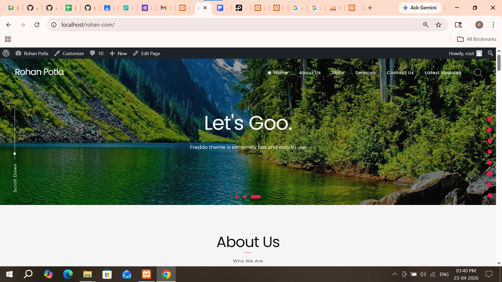
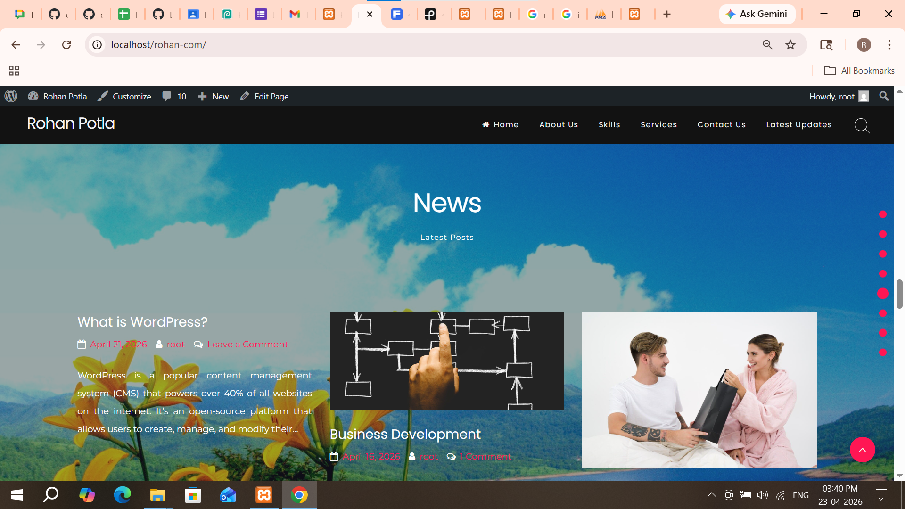
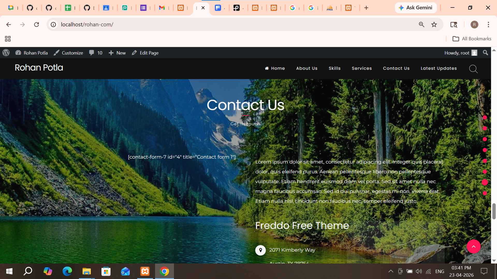
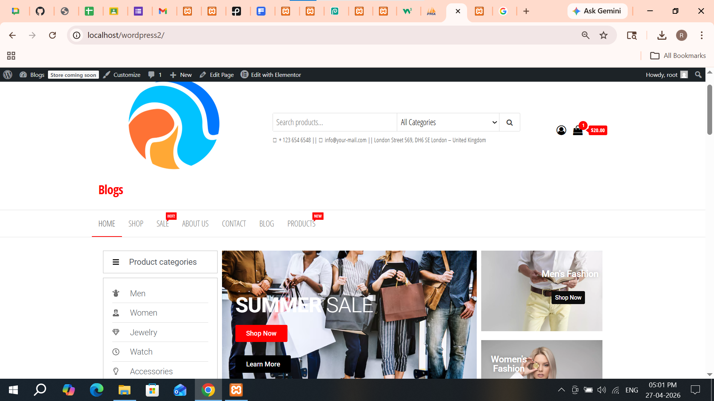
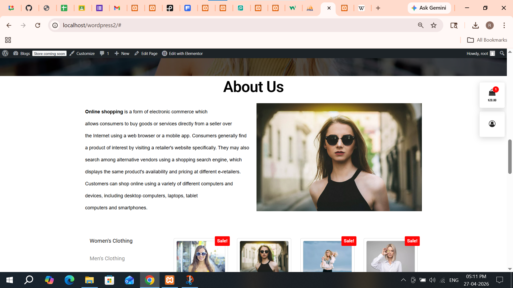
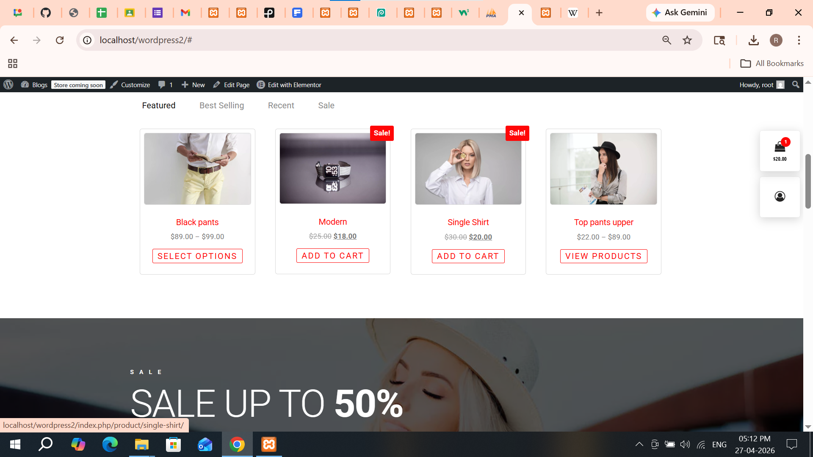
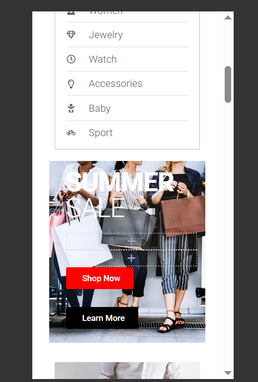

# Day 10 — Business Website (Envo Storefront)

---

## Task 1

### Understanding Envo Storefront Setup

Explored how an eCommerce/business website is structured using the Envo Storefront WordPress theme.

**Performed actions:**

- Created database: `wordpress1`
- Installed WordPress locally
- Created website: `envostore`
- Changed permalink settings to "Post name"
- Installed and activated Envo Storefront theme
- Reviewed default homepage layout and WooCommerce integration

**Image:**

1. [Link](day-10-img-1.png)

---

## Task 2

### Installing WooCommerce & Importing Demo

Configured the website with eCommerce functionality and demo content.

**Performed actions:**

- Installed and activated WooCommerce plugin
- Completed WooCommerce setup wizard
- Installed required plugins (Elementor, demo importer)
- Imported Envo Storefront demo site
- Fixed demo import issues (if any)
- Verified homepage sections like banners, products, categories

**Image:**

1. [Link](day-10-img-2.png)

---

## Task 3

### Creating Pages & Homepage Setup

Customized business pages and homepage layout.

**Performed actions:**

- Created pages: Home, Shop, About, Contact
- Set static homepage in settings
- Edited homepage using Elementor
- Modified sections like featured products, banners, offers
- Added sample products using WooCommerce

**Image:**

1. [Link](day-10-img-3.png)

---

## Task 4

### Navigation & UI Customization

Configured menus, layout, and responsive design.

**Performed actions:**

- Created main navigation menu
- Added pages to header menu
- Configured mobile menu layout
- Customized header (logo, cart icon, search bar)
- Adjusted spacing, fonts, and colors
- Tested responsive design on mobile view

**Image:**

1. [Link](day-10-img-4.png)

---

## Task 5

### Debugging & Final Optimization

Fixed issues and improved frontend experience.

**Performed actions:**

- Resolved layout and alignment issues
- Checked WooCommerce product display
- Fixed broken links or missing sections
- Optimized footer content and widgets
- Added scroll-to-top button
- Verified overall UI consistency

**Image:**

1. [Link](day-10-img-5.png)

---

## Task 6

### Documentation & Final Output

Verified complete business/eCommerce website setup.

**Working URL:**

- Frontend: http://localhost/envostore

**Demo Output:**

- Envo Storefront theme installed successfully
- WooCommerce integrated with product listings
- Homepage fully customized
- Navigation and mobile responsiveness working
- UI improved with clean layout and styling
- Website ready for business use

**Images:**

- Website setup and customization: [Link](day-10-img-1.png)

## Screenshots

### 1

### 2

### 3

---

# Screenshots

## Logo

## Aboutus

## Products

## mobile view

