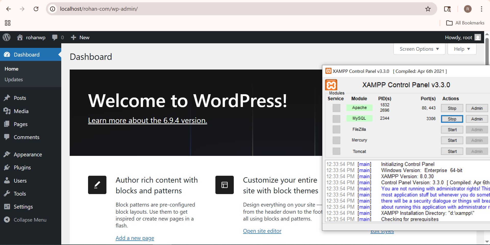
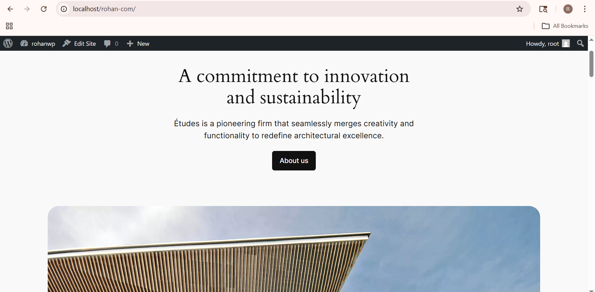

# Task 1

## Implement core concept

I explored the WordPress dashboard, which acts as the main control panel of the website. From the dashboard, I can manage posts, pages, media, plugins, and settings. I understood how each section helps in controlling different parts of the website.

I also explored permalinks, which define the structure of URLs for posts and pages. I learned that using a proper permalink structure (like post name) makes URLs more readable and SEO-friendly.

---

# Task 2

## Create / Configure Feature

I created sample blog posts to understand how categories and tags work. I assigned different categories to posts and added multiple tags to describe the content.

I configured the permalink settings by going to Settings → Permalinks and changed it to “Post Name” format. This made the URLs clean and easy to understand.

I also explored different sections of the dashboard like Posts, Pages, and Media to understand how content is created and managed.

---

# Task 3

## Customize UI / Settings

I customized the permalink structure to improve the appearance of URLs. I organized posts properly using categories and tags to make content easy to find.

I also explored dashboard settings and adjusted basic options like site title, timezone, and reading settings. This helped me understand how the UI and settings can be customized without coding.

---

# Task 4

## Debug / Optimize

While working, I checked for common issues such as incorrect permalink settings that may cause broken links. I fixed these by re-saving the permalink settings.

I ensured that categories and tags are not duplicated and are used properly to avoid confusion. I also reviewed the dashboard settings to make sure everything is correctly configured for smooth performance.

---

# Task 5

## Documentation + Demo Output

I documented all the steps I performed while exploring the dashboard, permalinks, categories, and tags. I verified the output by checking whether posts are correctly categorized and URLs are working properly.

---

## Screenshots

### plugin Dashboard

### Freddo theme

---
