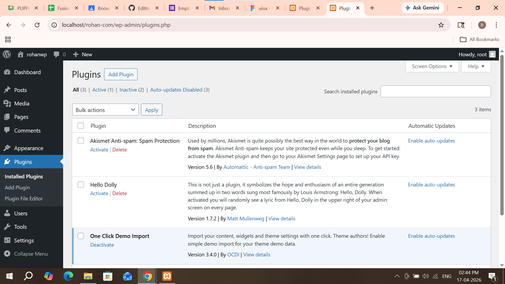
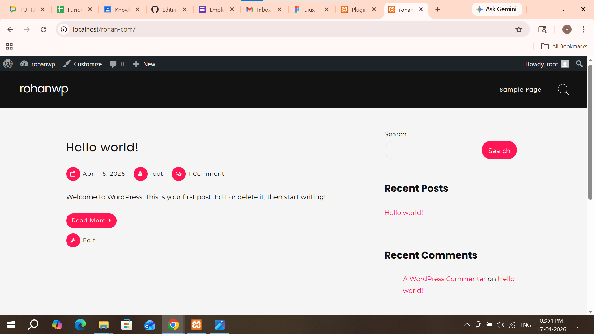

# Task 1

## Implement Core Concept

### Themes & Plugins

I explored WordPress themes and plugins. Themes are used to control the design and appearance of the website, while plugins are used to add extra features and functionality. I understood how themes change the overall look and how plugins extend the website capabilities without coding.

---

# Task 2

## Create / Configure Feature

I installed and activated a theme to change the website design. I also installed plugins to add features like forms and customization. I explored how to manage themes and plugins from the dashboard and configured basic settings for proper functionality.

---

# Task 3

## Customize UI / Settings

I customized the installed theme by changing colors, fonts, and layout using the customization options. I also configured plugin settings based on the required features. This helped me understand how to improve the website appearance and functionality without coding.

---

# Task 4

## Debug / Optimize

I checked for issues like plugin conflicts and ensured all plugins are working properly. I removed unused themes and plugins to improve performance. I also updated themes and plugins to the latest version for better security and stability.

---

# Task 5

## Documentation + Demo Output

I documented all the steps I performed while exploring themes and plugins. I verified the output by checking the applied theme design and plugin features. This confirmed that customization and functionality are working correctly in WordPress.

---

## Screenshots

### plugin Dashboard

### Freddo theme

---
