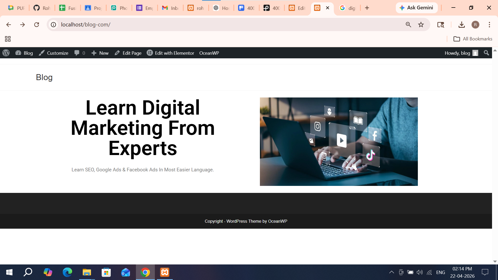
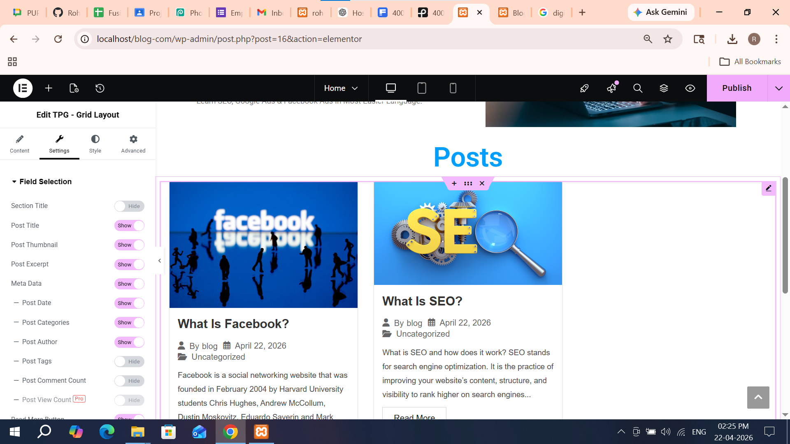

# Task 1: Implement Core Concept

## Build Blog Website

I explored how to build a basic blog website using WordPress. I understood how a homepage and blog posts work together. The homepage acts as the main entry point, while posts display dynamic content.

---

# Task 2: Create / Configure Feature

I created a basic blog website with a homepage and two posts. I configured the homepage layout and added blog posts with titles, images, and content. I ensured the posts are displayed properly on the blog page.

---

# Task 3: Customize UI / Settings

I customized the homepage using a theme and page builder. I adjusted layout, text, and images to improve the design. I also ensured the blog section displays posts clearly.

---

# Task 4: Debug / Optimize

I checked for issues like posts not displaying properly and fixed them. I ensured images and content load correctly. I also verified that navigation between homepage and posts works smoothly.

---

# Task 5: Documentation + Demo Output

I documented all the steps and verified the output. The homepage and blog posts are working correctly. This confirms successful creation of a basic blog website.

---

## Screenshots

### Homepage

### Blog Posts

