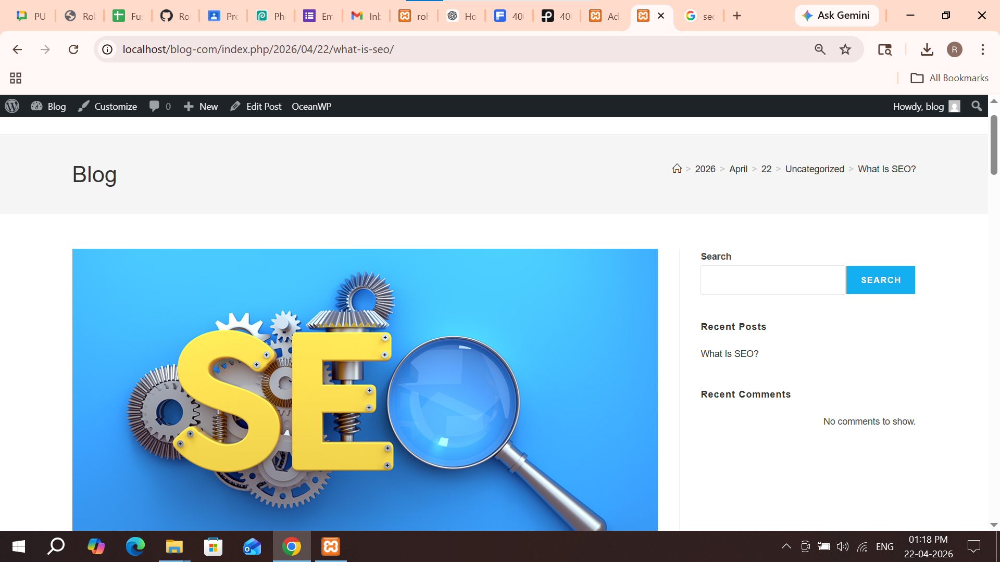

# Task 1: Implement Core Concept

## Build blog and portfolio Website

Learned the core concepts of WordPress as a Content Management System (CMS).

- What is WordPress and how it works
- Difference between posts and pages
- Overview of dashboard, media, and settings
- Introduction to themes and plugins
---

# Task 2: Create / Configure Feature

Configured and prepared a working WordPress website.

- Installed WordPress (local/server)
- Configured general settings (site title, permalink)
- Created basic pages and posts
- Installed and activated themes and plugins
---

# Task 3: Customize UI / Settings

Configured and prepared a working WordPress website.

- Installed WordPress (local/server)
- Configured general settings (site title, permalink)
- Created basic pages and posts
- Installed and activated themes and plugins

---

# Task 4: Debug / Optimize

Ensured the website works properly and efficiently.

- Tested all pages and links
- Fixed layout and plugin issues
- Improved website speed and responsiveness
- Checked mobile compatibility
---

# Task 5: Documentation + Demo Output

I documented all the steps and verified the output. The homepage and blog posts are working correctly. This confirms successful creation of a basic blog website.

---

## Screenshots

### Homepage

### Blog Posts

### Blog

