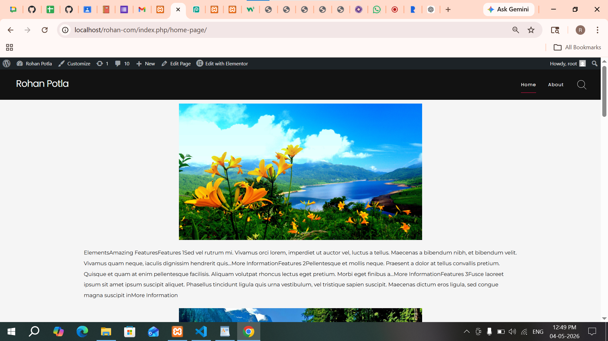
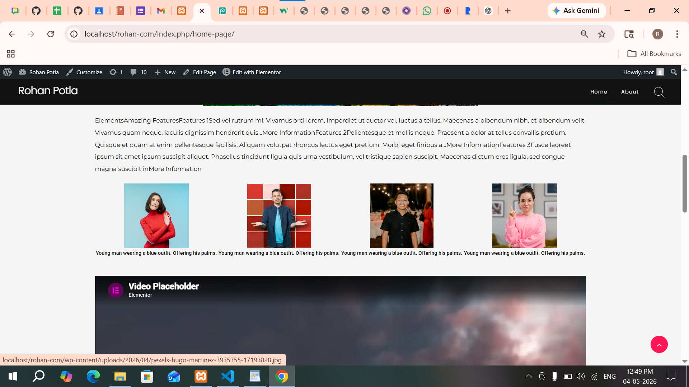
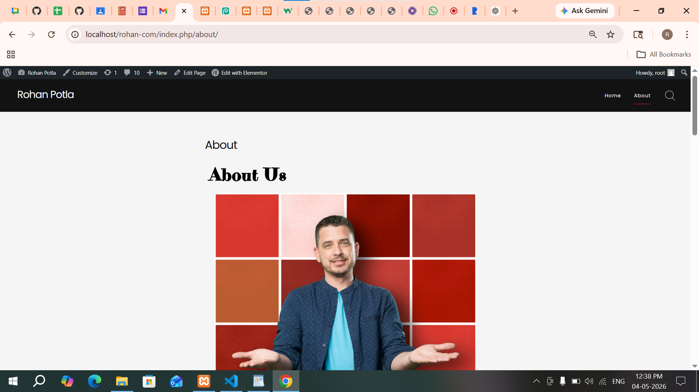
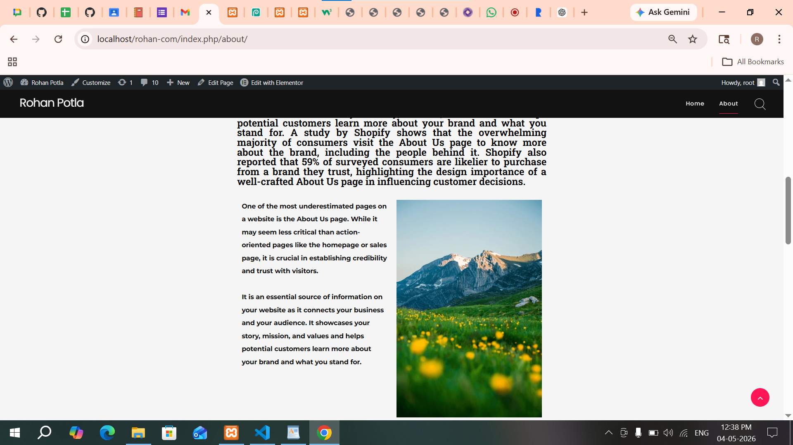

# Day 10 — Elementor Website Customization

---

## Task 1

### Editing Homepage with Elementor

Explored Elementor page builder and customized the homepage layout.

**Performed actions:**

- Opened homepage using "Edit with Elementor"
- Modified hero section image and text
- Adjusted section layout and alignment
- Updated content with dummy business data

**Screenshot:**

---

## Task 2

### Adding Features Section

Customized feature/content sections on the homepage.

**Performed actions:**

- Edited "Features" section using Elementor
- Updated headings and paragraph content
- Adjusted spacing and typography
- Added "More Information" buttons

**Screenshot:**

---

## Task 3

### Team / Image Section Customization

Configured image and team-related sections.

**Performed actions:**

- Added multiple image blocks (team members)
- Updated image captions and descriptions
- Adjusted alignment and spacing
- Verified section layout consistency

**Screenshot:**

---

## Task 4

### About Page Customization

Edited About page using Elementor.

**Performed actions:**

- Opened About page in Elementor
- Modified "About Us" heading and content
- Updated images and layout structure
- Ensured proper spacing and alignment

**Screenshot:**

---

## Task 5

### Responsive Testing & Final Touches

Tested and optimized website for different devices.

**Performed actions:**

- Checked mobile and tablet responsiveness
- Adjusted font sizes and spacing for smaller screens
- Verified navigation and section visibility
- Ensured consistent UI across pages

**Screenshots:**

- Homepage and About page verified with proper layout
- All sections aligned and responsive

---

## Final Output

- Homepage customized using Elementor
- Features and team sections updated
- About page properly designed
- Responsive design tested successfully
- Website UI improved with clean layout
